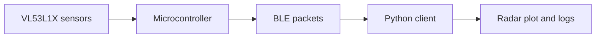

## Repository Note

This repository is a cleaned public portfolio version of my PhD research codebase. It contains selected code structure, configuration examples, documentation and representative scripts for a VL53L1X time-of-flight sensor array used for near-360-degree robotic obstacle detection.

Sensitive data, raw experimental logs, facility-specific information and unpublished research materials have been removed.# Lightweight ToF Obstacle Detection Array

This repository documents a lightweight time-of-flight obstacle-perception system developed for robotic navigation under strict payload and power constraints.

The system uses a decagonal array of VL53L1X ToF sensors and BLE data streaming to provide near-360 degree obstacle awareness for a mobile robotic platform.

## What this project demonstrates

- Embedded sensing with Arduino-compatible firmware
- Multi-sensor timing and data collection
- BLE communication for low-latency telemetry
- Real-time radar-style visualisation in Python
- Practical perception engineering for small robots

## Repository structure

```text
firmware/     Arduino-style firmware template for the ToF sensor array
scripts/      BLE client and radar visualisation template
docs/         Hardware and calibration notes
media/        Add public-safe photos or plots here
```

## System overview



## Results to add

TODO:

- sensor ring photo
- radar-chart screenshot
- latency measurement
- detection-range test
- known limitations

## Safety note

Do not include device IDs, private lab network details or unpublished restricted data.
